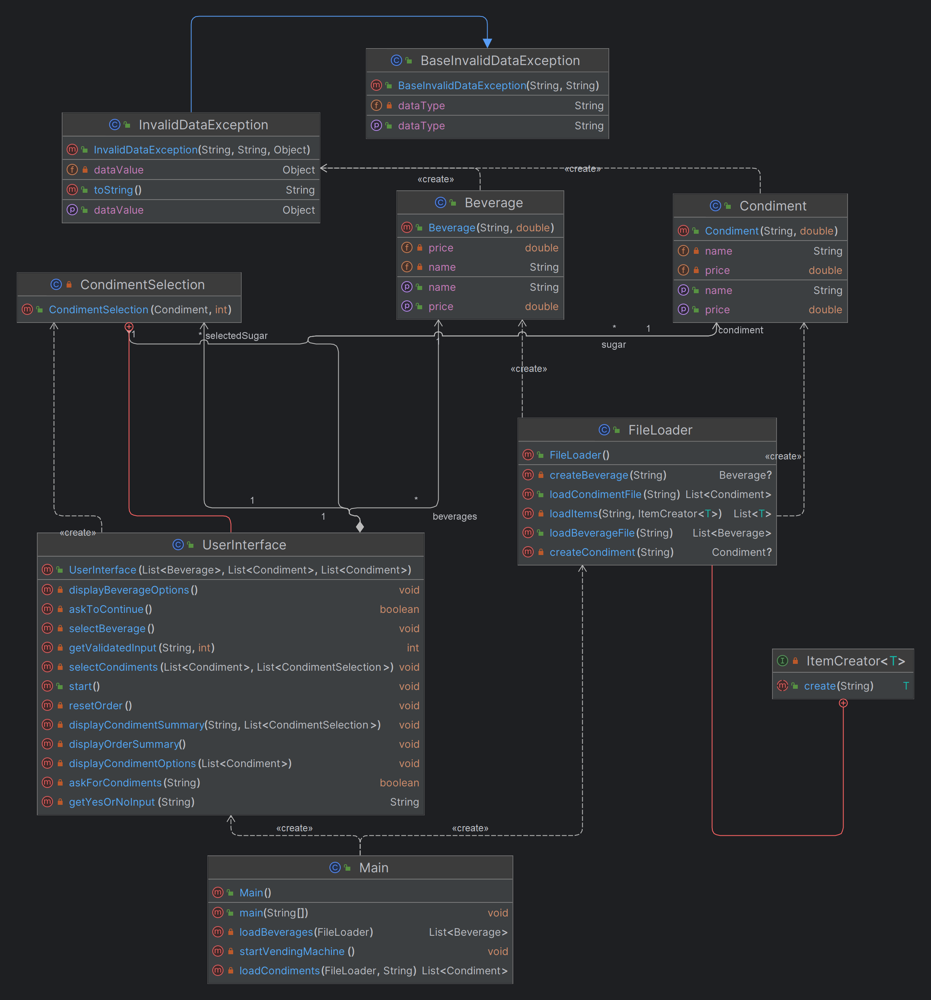

| CS-665       | Software Design & Patterns |
| ------------ | -------------------------- |
| Name         | Dingnan Hsu                |
| Date         | 12/01/2023                 |
| Course       | 2023 Fall                  |
| Assignment # | 6                          |

# Assignment Overview

The system starts with a user welcome and loads beverage and condiment data from CSV files, handling errors. Users interact with the vending machine through an intuitive interface.

For this time assignment, address at least 3 areas of code improvement.

# GitHub Repository Link:

- Assignment-6 URL:
  - https://github.com/dddingnan/cs-665-assignment-6
- Refactor based on the assignment-1 URL:
  - https://github.com/dddingnan/cs-665-assignment-1

## Task

### Examine your code and identify opportunities for code improvement

- `Main.java`

  - The Specific Opportunities

    - `Method Extraction`: Extracting `loadBeverages and loadCondiments` methods from main.
    - `Use of Constants`: Defining file paths as constants (`BEVERAGE_FILE_PATH, SUGAR_FILE_PATH, MILK_FILE_PATH`).
    - `Enhanced Readability`: Separating the vending machine startup process into `startVendingMachine`.

  - The Reasons

    - `Method Extraction`: Adhering to the `Single Responsibility Principle`. Each method now focuses on a specific task, making the code more modular.
    - `Use of Constants`: Reducing the likelihood of errors or missed updates.
    - `Enhanced Readability`: This separation makes it easier to understand the flow and potentially update the startup process in the future.

  - The Chagnes

    - Before refactor:

      ```
      public class Main {
         public static void main(String[] args) throws InvalidDataException, InterruptedException {
            System.out.println("Hello! Welcome to the Automatic Beverage Vending Machine System!");
            System.out.println("--------------------------------------------------------");
            List<Beverage> beverages = new ArrayList<>();
            List<Condiment> sugar = new ArrayList<>();
            List<Condiment> milk = new ArrayList<>();
            FileLoader loader = new FileLoader();
            beverages = loader.loadBeverageFile("src/data/beverage.csv");
            sugar = loader.loadCondimentFile("src/data/sugar.csv");
            milk = loader.loadCondimentFile("src/data/milk.csv");
            UserInterface ui = new UserInterface(beverages, sugar, milk);
            ui.start();
         }
      }
      ```

    - After refactor:

      ```
      public class Main {
         private static final String BEVERAGE_FILE_PATH = "src/main/resources/data/beverage.csv";
         private static final String SUGAR_FILE_PATH = "src/main/resources/data/sugar.csv";
         private static final String MILK_FILE_PATH = "src/main/resources/data/milk.csv";

         public static void main(String[] args) {
            try {
               System.out.println("Initializing the Vending Machine...");
               startVendingMachine();
            } catch (Exception e) {
               System.err.println("Error initializing the Vending Machine: " + e.getMessage());
               e.printStackTrace();
            }
         }

         private static void startVendingMachine() throws InterruptedException, InvalidDataException {
            FileLoader loader = new FileLoader();

            List<Beverage> beverages = loadBeverages(loader);
            List<Condiment> sugars = loadCondiments(loader, SUGAR_FILE_PATH);
            List<Condiment> milks = loadCondiments(loader, MILK_FILE_PATH);

            UserInterface ui = new UserInterface(beverages, sugars, milks);
            ui.start();
         }

         private static List<Beverage> loadBeverages(FileLoader loader) throws InvalidDataException {
            System.out.println("Loading beverages...");
            return loader.loadBeverageFile(BEVERAGE_FILE_PATH);
         }

         private static List<Condiment> loadCondiments(FileLoader loader, String filePath) throws InvalidDataException {
            System.out.println("Loading condiments from " + filePath + "...");
            return loader.loadCondimentFile(filePath);
         }
      }
      ```

- `UserInterface.java`

  - The Specific Opportunities

    - `Method Extraction and Refinement`: Breaking down the `start()` method into smaller, focused methods (`displayBeverageOptions, selectBeverage, askForCondiments, selectCondiments, displayOrderSummary, resetOrder`).
    - `Input Validation Refinement`: Implementing `getYesOrNoInput` and `getValidatedInput` for more robust input validation.
    - `Encapsulation of Scanner Usage`: Managing the Scanner instance more effectively, including its closure.

  - The Reasons

    - `Method Extraction and Refinement`: Each method now handles a specific part of the user interaction, making the code easier to understand and modify.
    - `Input Validation Refinement`: The new validation methods ensure that only appropriate inputs are accepted (`'Y' or 'N', valid integers`), preventing potential user errors and improving the robustness of the application.
    - `Encapsulation of Scanner Usage`: Prevents potential resource leaks and ensures that the scanner is closed correctly.

  - The Chagnes

    - Before refactor:

      ```
       public class FileLoader {
         public String line = "";
         public String splitBy = ",";

         public List<Beverage> loadBeverageFile(String fileName) {
               // Implementation
         }

         public List<Condiment> loadCondimentFile(String fileName) {
               // Implementation
         }
      }
      ```

    - After refactor:

      ```
      public class FileLoader {
         private static final String SPLIT_BY = ",";

         public List<Beverage> loadBeverageFile(String fileName) throws InvalidDataException {
            return loadItems(fileName, this::createBeverage);
         }

         public List<Condiment> loadCondimentFile(String fileName) throws InvalidDataException {
            return loadItems(fileName, this::createCondiment);
         }

         private <T> List<T> loadItems(String fileName, ItemCreator<T> creator) throws InvalidDataException {
            // Implementation
         }

         private Beverage createBeverage(String line) {
            // Implementation
         }

         private Condiment createCondiment(String line) {
            // Implementation
         }

         @FunctionalInterface
         private interface ItemCreator<T> {
            T create(String line) throws InvalidDataException;
         }
      }
      ```

- `FileLoader.java`

  - The Specific Opportunities

    - `Method Extraction and Generalization`: Implementing a `generic loadItems method and specific createBeverage and createCondiment methods`.
    - `Functional Interface Usage`: Utilizing a functional `interface ItemCreator<T>` for item creation.
    - `Use of NIO for File Reading`: Switching to NIO (New I/O) for more efficient and flexible file reading.

  - The Reasons

    - `Method Extraction and Generalization`: The generic method `loadItems ` reduces code duplication and increases code clarity by handling the common task of file reading and item creation.
    - `Functional Interface Usage`: `ItemCreator<T>` provides flexibility in handling different types of objects and encapsulates the creation logic, making the code more modular.
    - `Use of NIO for File Reading`: Java NIO offers improved performance and flexibility over traditional I/O methods, enhances the code's overall efficiency.

  - The Chagnes

    - Before refactor:

      ```
       public class FileLoader {
         public String line = "";
         public String splitBy = ",";

         public List<Beverage> loadBeverageFile(String fileName) {
               // Implementation
         }

         public List<Condiment> loadCondimentFile(String fileName) {
               // Implementation
         }
      }
      ```

    - After refactor:

      ```
      public class FileLoader {
         private static final String SPLIT_BY = ",";

         public List<Beverage> loadBeverageFile(String fileName) throws InvalidDataException {
            return loadItems(fileName, this::createBeverage);
         }

         public List<Condiment> loadCondimentFile(String fileName) throws InvalidDataException {
            return loadItems(fileName, this::createCondiment);
         }

         private <T> List<T> loadItems(String fileName, ItemCreator<T> creator) throws InvalidDataException {
            // Implementation
         }

         private Beverage createBeverage(String line) {
            // Implementation
         }

         private Condiment createCondiment(String line) {
            // Implementation
         }

         @FunctionalInterface
         private interface ItemCreator<T> {
            T create(String line) throws InvalidDataException;
         }
      }
      ```

---

## Design patterns

- `Design patterns`:
  - `Factory Pattern`: The FileLoader class abstracts away the details of object creation from CSV files, providing an easy and consistent way to generate data objects. [This is to deal with the problem of creating objects without having to specify the exact class of the object that will be created.](https://en.wikipedia.org/wiki/Factory_method_pattern)

## UML Diagram



# Maven Commands

We'll use Apache Maven to compile and run this project. You'll need to install Apache Maven (https://maven.apache.org/) on your system.

Apache Maven is a build automation tool and a project management tool for Java-based projects. Maven provides a standardized way to build, package, and deploy Java applications.

## Compile

Type on the command line:

```bash
mvn clean compile
```

## Run

Type on the command line:

```bash
mvn exec:java
```

## JUnit Tests

JUnit is a popular testing framework for Java. JUnit tests are automated tests that are written to verify that the behavior of a piece of code is as expected.

In JUnit, tests are written as methods within a test class. Each test method tests a specific aspect of the code and is annotated with the @Test annotation. JUnit provides a range of assertions that can be used to verify the behavior of the code being tested.

To run, use the following command:

```bash
mvn clean test
```

## Spotbugs

SpotBugs is a static code analysis tool for Java that detects potential bugs in your code. It is an open-source tool that can be used as a standalone application or integrated into development tools such as Eclipse, IntelliJ, and Gradle.

SpotBugs performs an analysis of the bytecode generated from your Java source code and reports on any potential problems or issues that it finds. This includes things like null pointer exceptions, resource leaks, misused collections, and other common bugs.

Use the following command:

```bash
mvn spotbugs:gui
```

For more info see
https://spotbugs.readthedocs.io/en/latest/maven.html

SpotBugs https://spotbugs.github.io/ is the spiritual successor of FindBugs.

## Checkstyle

Checkstyle is a development tool for checking Java source code against a set of coding standards. It is an open-source tool that can be integrated into various integrated development environments (IDEs), such as Eclipse and IntelliJ, as well as build tools like Maven and Gradle.

Checkstyle performs static code analysis, which means it examines the source code without executing it, and reports on any issues or violations of the coding standards defined in its configuration. This includes issues like code style, code indentation, naming conventions, code structure, and many others.

The following command will generate a report in HTML format that you can open in a web browser.

```bash
mvn checkstyle:checkstyle
```

The HTML page will be found at the following location:
`target/site/checkstyle.html`
