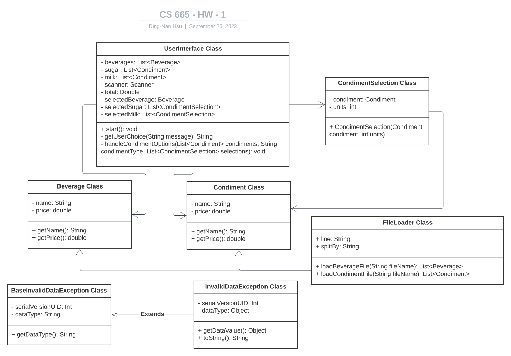

| CS-665       | Software Design & Patterns |
| ------------ | -------------------------- |
| Name         | Dingnan Hsu                |
| Date         | 09/21/2023                 |
| Course       | 2023 Fall                  |
| Assignment # | 1                          |

# Assignment Overview

The system starts with a user welcome and loads beverage and condiment data from CSV files, handling errors. Users interact with the vending machine through an intuitive interface.

# GitHub Repository Link:

https://github.com/dddingnan/cs-665-assignment-1

# Implementation Description

For each assignment, please answer the following:

- Explain the level of flexibility in your implementation, including how new object types can
  be easily added or removed in the future.
- Discuss the simplicity and understandability of your implementation, ensuring that it is
  easy for others to read and maintain.
- Describe how you have avoided duplicated code and why it is important.
- If applicable, mention any design patterns you have used and explain why they were
  chosen.

---

### `Answer`

1. `Flexibility`
   - `Generic Objects`: Beverage and Condiment objects are designed to be versatile. Adding new types of beverages or condiments is as easy as creating new instances of these objects or updating CSV files.
   - `CSV Data Storage`: Using CSV files for data storage makes it simple to add, modify, or remove beverages and condiments without changing the core code.
2. `Simplicity & Understandability`
   - The main interaction point, the UserInterface, lead the user through the system, just like the logical flow that expect from an actual vending machine.
3. `Avoidance of Duplicated Code`
   - By separating classes for different functionalities. For instance, FileLoader takes care of all file-loading operations, ensuring that there's no repetition of file reading logic.
   - The use of generic classes like Beverage and Condiment prevents the need to create separate classes for each type of beverage or condiment, minimizing redundancy.
   - Avoiding duplicated code is essential for maintaining the application efficiently. When changes or bug fixes are required, you'll only have to make them in one place, reducing the risk of errors and inconsistencies.
4. `Design patterns`
   - `Factory Pattern`: The FileLoader class abstracts away the details of object creation from CSV files, providing an easy and consistent way to generate data objects. [This is to deal with the problem of creating objects without having to specify the exact class of the object that will be created.](https://en.wikipedia.org/wiki/Factory_method_pattern)

## UML Diagram



# Maven Commands

We'll use Apache Maven to compile and run this project. You'll need to install Apache Maven (https://maven.apache.org/) on your system.

Apache Maven is a build automation tool and a project management tool for Java-based projects. Maven provides a standardized way to build, package, and deploy Java applications.

## Compile

Type on the command line:

```bash
mvn clean compile
```

## Run

Type on the command line:

```bash
mvn exec:java
```

## JUnit Tests

JUnit is a popular testing framework for Java. JUnit tests are automated tests that are written to verify that the behavior of a piece of code is as expected.

In JUnit, tests are written as methods within a test class. Each test method tests a specific aspect of the code and is annotated with the @Test annotation. JUnit provides a range of assertions that can be used to verify the behavior of the code being tested.

To run, use the following command:

```bash
mvn clean test
```

## Spotbugs

SpotBugs is a static code analysis tool for Java that detects potential bugs in your code. It is an open-source tool that can be used as a standalone application or integrated into development tools such as Eclipse, IntelliJ, and Gradle.

SpotBugs performs an analysis of the bytecode generated from your Java source code and reports on any potential problems or issues that it finds. This includes things like null pointer exceptions, resource leaks, misused collections, and other common bugs.

Use the following command:

```bash
mvn spotbugs:gui
```

For more info see
https://spotbugs.readthedocs.io/en/latest/maven.html

SpotBugs https://spotbugs.github.io/ is the spiritual successor of FindBugs.

## Checkstyle

Checkstyle is a development tool for checking Java source code against a set of coding standards. It is an open-source tool that can be integrated into various integrated development environments (IDEs), such as Eclipse and IntelliJ, as well as build tools like Maven and Gradle.

Checkstyle performs static code analysis, which means it examines the source code without executing it, and reports on any issues or violations of the coding standards defined in its configuration. This includes issues like code style, code indentation, naming conventions, code structure, and many others.

The following command will generate a report in HTML format that you can open in a web browser.

```bash
mvn checkstyle:checkstyle
```

The HTML page will be found at the following location:
`target/site/checkstyle.html`
